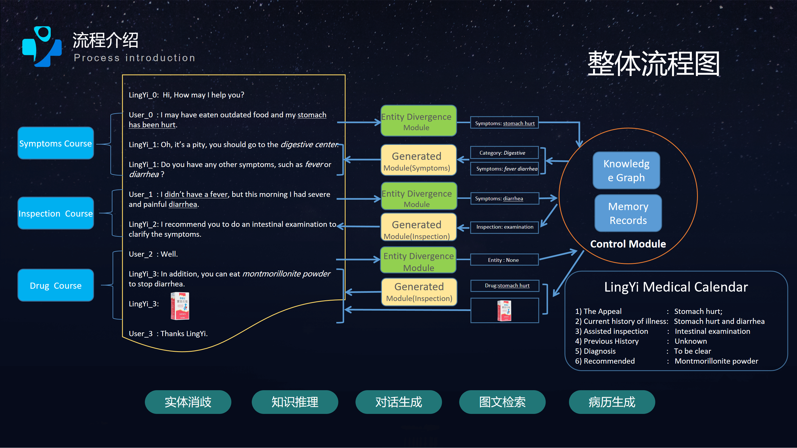
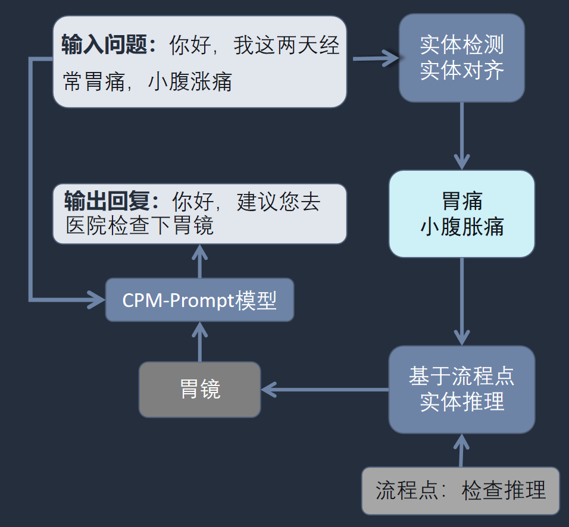
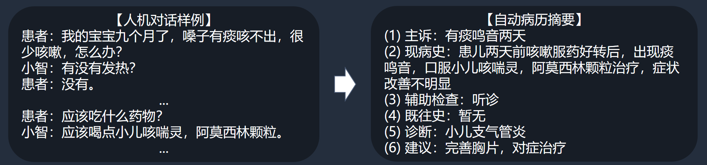
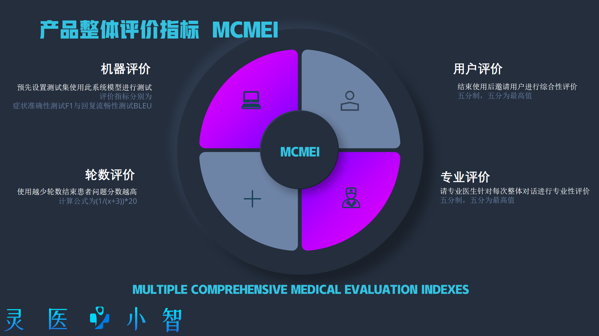
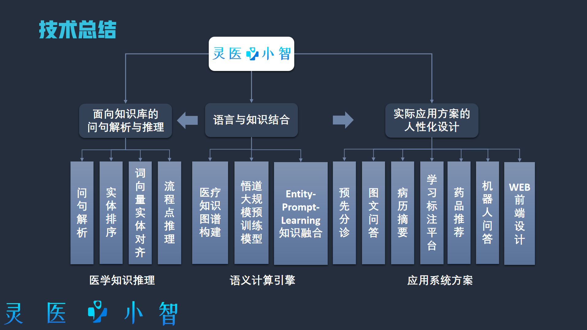

# LingYi 技术文档

### 您可前往[灵医小智](http://kg.wengsyx.com)预览我们的系统。

### 

####          如果可以通过准确有效的智能问诊系统，解决信任危机与医疗准确性问题，实时与患者进行沟通，收集患者信息，从而提升临床诊断的效率、减轻医生的负担、提高复诊积极性等，将可以有效缓解医生资源匮乏、医疗水平不平衡不充分、公众对互联网医疗信息存有疑虑等问题。

#### 我们以中文医学领域为例，制作了面向个人的自动化诊疗系统，命名为“灵医小智”。

#### “灵医小智”同时支持医院场景下智能预问诊台的搭建、药店场景下的咨询开药机器人搭建以及个人场景下的私人医生应用的搭建，深入医疗服务场景，凭借海量的医学知识和大规模预训练语言模型，服务于患者线上、线下医疗需求的全场景，提升医生服务效率，改善患者就医体验。

<h3 align="center">
    

        <b>分诊</b> |
        <b>推理</b> |
        <b>生成</b> |
        <b>数据</b> |
        <b>病历</b>
    

</h3>

<h1  align="center">
    整体流程
</h3>

#### 我们分别制作了八大模块，全方位以对话形式轻松快捷准确地为用户解决医疗问题，相比于市面上的“灵医智慧”、"左手医生"等智慧医疗产品，我们的个性化私人医生“灵医小智”项目致力于打造主动式友好医疗，覆盖“诊前”“诊中”“诊后”，基于悟道模型卓越的生成性能和图像识别能力，多模态感知患者病情，灵活多变的拟人化语言与患者进行自由交流，极大改善用户体验，缓解了医院的线下医疗服务压力，助力于患者居家康复管理。

### 分诊

##### 根据实际场景及调研需求，引入分诊模块，缩小患病范围，提升问诊精度

### 推理

 ##### 实体消歧技术，有利于对用户话语进行归一化处理。我们使用了[ADBCMM技术](https://github.com/WENGSYX/ADBCMM)，使得我们的模型能够准确判断用户所说实体的全称含义。

##### 消歧得到的实体，我们使用知识图谱推理技术，结合学界前沿知识问答技术，通过实体链接和多跳推理、路径排序等方式，并引入流程点方式，更为可控地搜寻下一步的目标实体，诸如可能患有的其他症状，进一步确诊所需的检查项目以及此疾病治疗所需药物等。

### 生成

#####  这一步中，将用到预训练生成模型。由于预训练生成模型是在通用文本上进行预训练，但是专业领域的推断能力不足。因此我们使用了ENTITY-PROMPT-LERARNING方法，在训练过程中，就将下句实体与流程点一并作为输入，进行训练。

##### 通过PROMPT的方式将对话上下文信息与实体信息进行融合，使得最后的回复具有预测的实体信息。 

### 病历

##### 医生与病人进行自动化问诊之后，需要就诊疗过程进行就诊报告的撰写，对病人的整体情况情况进行描述，我们基于悟道CPM模型，采用Casual Language model等技术，对比最先进的方法（SOTA）在CCL数据集上领先平均得分2.05分

# 项目评价指标

# 项目总结

**易用性**：通过医院机器人语音进行预问诊，并支持图片问诊，具备友好性。
**功能数**：丰富的系统功能，具备八大医疗模块。
**合作性**：产学研合作，分工明确，准确把握相关需求。
**商业性**：多模模块中图文推荐药品一键购买。
**覆盖面**：三十五大重点科室全覆盖。
**专业性**：使用Prompt算法融入知识图谱推理的实体，相比直接生成更具专业性。
**领先性**：采用本年度自然语言处理竞赛SOTA方案，进一步提升准确性。
**可控性**：Entity-Prompt与流程点推理，增加可控性。
**公益性**：有效缓解医生资源匮乏、医疗水平不平衡不充分。

