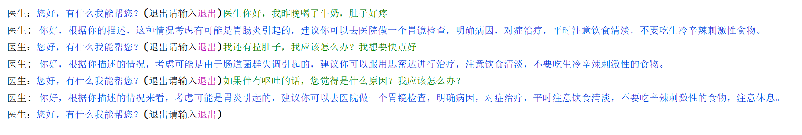

## MedConQA: Medical Conversational Question Answering System based on Knowledge Graphs

###### 

### How to use

##### We offer three experience types:

*1. Triage*  You can take your symptoms as input, and we will triage it.

*2. Dagnosis* You can ask any medical questions

*3. Summary* Take the doctor-patient dialogue as input, and the medical record  will be output

##### We offer three input mode:

*1.interactive* Support human-computer interaction experience demo

*2.api* Provide API interface for direct call

*3.batch* Provide input files for batch processing


### Example

```
python main.py --mode api --type Dagnosis --message 我肚子好疼
```

<center></center>

```
python main.py --mode interactiv --type Dagnosis
```

<center></center>

```
python main.py --mode batch --type Summary --file_name input.csv --result_file_name result.csv
```

<center></center>


## Cite
```
@inproceedings{xia-etal-2022-medconqa,
    title = "{M}ed{C}on{QA}: Medical Conversational Question Answering System based on Knowledge Graphs",
    author = "Xia, Fei  and
      Li, Bin  and
      Weng, Yixuan  and
      He, Shizhu  and
      Liu, Kang  and
      Sun, Bin  and
      Li, Shutao  and
      Zhao, Jun",
    booktitle = "Proceedings of the The 2022 Conference on Empirical Methods in Natural Language Processing: System Demonstrations",
    month = dec,
    year = "2022",
    address = "Abu Dhabi, UAE",
    publisher = "Association for Computational Linguistics",
    url = "https://aclanthology.org/2022.emnlp-demos.15",
    pages = "148--158",
    abstract = "The medical conversational system can relieve doctors{'} burden and improve healthcare efficiency, especially during the COVID-19 pandemic. However, the existing medical dialogue systems have the problems of weak scalability, insufficient knowledge, and poor controllability. Thus, we propose a medical conversational question-answering (CQA) system based on the knowledge graph, namely MedConQA, which is designed as a pipeline framework to maintain high flexibility. Our system utilizes automated medical procedures, including medical triage, consultation, image-text drug recommendation, and record. Each module has been open-sourced as a tool, which can be used alone or in combination, with robust scalability. Besides, to conduct knowledge-grounded dialogues with users, we first construct a Chinese Medical Knowledge Graph (CMKG) and collect a large-scale Chinese Medical CQA (CMCQA) dataset, and we design a series of methods for reasoning more intellectually. Finally, we use several state-of-the-art (SOTA) techniques to keep the final generated response more controllable, which is further assured by hospital and professional evaluations. We have open-sourced related code, datasets, web pages, and tools, hoping to advance future research.",
}
```
